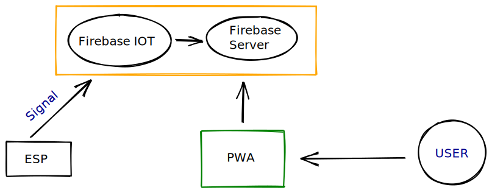

## SmartPark

#### PWA for Parking Space using IOT

#### Steps to run the django app:-

1. Create a virtual env with `python3 -m venv env`
2. Activate virtual env with `. env/bin/activate`
3. Install requirements using `pip install -r requirements.txt`
4. Run the server locally using `python3 manage.py runserver`
5. Go to `http://127.0.0.1:8000/`
